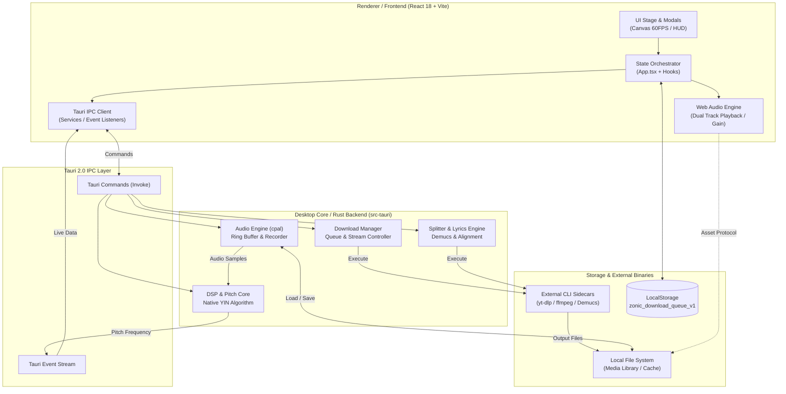

# System Architecture (HLD)

## 1. System Overview & Tech Reality
- **System Type:** Desktop Application (Tauri 2.0 Local-first Audio Workstation & Vocal Training Studio)
- **Runtime & Constraints:** Tauri 2.0 / Rust 2021 Backend + Chromium WebView2 Frontend (React 18, Vite, TypeScript). การประมวลผล Audio DSP, AI Inference และการจัดการไฟล์สื่อทำงานแบบ Local-only 100% บนเครื่องผู้ใช้ ไม่พึ่งพา Cloud Server
- **Core Architecture Style:** Asynchronous IPC Pipeline (Tauri Invoke & Event Bus) ผสานกับ Centralized React State Orchestration ใน Renderer และ Real-time Ring Buffer Audio Engine ใน Rust Native Core
- **Implementation Status:** Partial (Core Audio Capture, DSP YIN Algorithm, Lyrics Parser, Downloader CLI และ UI Stage มีการ Implement ใช้งานได้จริง; บางส่วนเช่น AI Stem Separator และ Forced Alignment อยู่ในระดับ Prototype Integration)

---

## 2. High-Level Architecture Diagram

---

## 3. Core Subsystems & Boundaries

### 1) UI & Canvas Rendering Subsystem
- **Boundary:** `src/components/*`, `src/index.css`
- **Responsibility:** แสดงผลอินเทอร์เฟซผู้ใช้, Interactive HUD, การควบคุมแทร็กเสียง และเรนเดอร์กราฟระดับเสียง (Pitch Note Grid & Live Beam) บน HTML5 Canvas ที่ความเร็ว 60 FPS
- **Depends On:** Frontend State Hooks, Web Audio Context, TypeScript Types
- **Boundary Rules:** ห้ามเข้าถึง Tauri IPC หรือ File System โดยตรง ต้องผ่าน Custom Hooks หรือ Service Layer เท่านั้น
- **Implementation Status:** Implemented

### 2) Frontend State & Audio Playback Orchestrator
- **Boundary:** `src/App.tsx`, `src/hooks/*`
- **Responsibility:** ทำหน้าที่เป็นศูนย์กลางบริหาร State ของแทร็กเสียงคู่ (Original/Backing), ค่า Gain, คีย์ดนตรี (Transpose), Speed, สถานะการบันทึกเสียง โดยแยกการซิงค์วิดีโอออกเป็น `src/hooks/useVideoSync.ts` และควบคุม Throttled Playhead State (~25 FPS สำหรับ DOM, 60 FPS สำหรับ Canvas Ref)
- **Depends On:** `src/services/*`, `src/types/*`, Web Audio API, Browser LocalStorage
- **Boundary Rules:** ควบคุมเฉพาะ In-Memory Lifecycle ในหน้าจอ UI; การคำนวณ Heavy DSP ให้ส่งต่อ Native Backend
- **Implementation Status:** Partial (แยก Video Lifecycle ออกแล้ว, มีแผนสกัด Web Audio Engine Hook เพิ่มเติม)

### 3) Tauri IPC & Event Bridge
- **Boundary:** `src/services/*`, `src-tauri/src/lib.rs`
- **Responsibility:** กำหนด Command Handlers และ Event Emitters เพื่อเชื่อมต่อระหว่าง TypeScript Renderer และ Rust Native Engine
- **Depends On:** `@tauri-apps/api`, `tauri::ipc`
- **Boundary Rules:** ข้อมูลที่ส่งผ่าน IPC ต้อง Serialize/Deserialize ผ่าน Serde JSON; ห้ามส่ง Raw PCM Buffer ขนาดใหญ่ต่อเนื่องผ่าน String serialization (ใช้ Binary/Asset Protocol หรือ Event Stream)
- **Implementation Status:** Implemented

### 4) Hardware Audio & Recorder Subsystem
- **Boundary:** `src-tauri/src/audio/*`
- **Responsibility:** ตรวจหาอุปกรณ์ไมโครโฟนฮาร์ดแวร์ผ่าน `cpal`, บันทึกสัญญาณเสียงสดลง Ring Buffer ด้วย `CircularAudioBuffer` (240,000 samples คงที่, Cyclic Pointer Index), ป้องกัน Audio Dropouts และจัดการ I/O ไฟล์เสียง
- **Depends On:** `cpal`, `hound`, `symphonia`, `parking_lot::Mutex`
- **Boundary Rules:** Low-latency Real-time Thread ใน Audio Callback ห้ามเรียกบล็อก I/O หรือ Memory Allocation ที่ใช้เวลานาน (ขจัด Heap Alloc และ Vec::drain เรียบร้อยแล้ว)
- **Implementation Status:** Implemented (Zero-allocation Cyclic Buffer)

### 5) Native DSP & Pitch Analysis Engine
- **Boundary:** `src-tauri/src/dsp/*`
- **Responsibility:** ประมวลผลความถี่เสียงสดด้วย YIN Pitch Detection Algorithm, แปลงสัญญาณเสียงสดเป็นความถี่ Hertz และค่าความมั่นใจ (Confidence) เพื่อส่งกลับมาประเมินคะแนนร้องเพลง
- **Depends On:** `AudioState`, `rayon`
- **Boundary Rules:** รับข้อมูลจาก Ring Buffer เท่านั้น ไม่ยุ่งเกี่ยวกับ UI State
- **Implementation Status:** Implemented

### 6) Sidecar Process & Media Management Subsystem
- **Boundary:** `src-tauri/src/downloader/*`, `src-tauri/src/splitter/*`, `src-tauri/src/lyrics/*`
- **Responsibility:** ควบคุม Process ภายนอก (yt-dlp สำหรับดาวน์โหลดสตรีม, ffmpeg สำหรับแปลงไฟล์, Demucs AI สำหรับแยก Stem เสียง) และจัดระเบียบไฟล์ LRC/Forced Alignment
- **Depends On:** `tokio::process`, External Binaries (`binaries/yt-dlp`, `binaries/ffmpeg`)
- **Boundary Rules:** ทำงานแบบ Non-blocking Async Tasks ใน Background Thread และแจ้งผลผ่าน Event พร้อมรองรับการ Cancel Process
- **Implementation Status:** Partial (Downloader ทำงานเสร็จสมบูรณ์, Splitter และ Alignment กำลังพัฒนาต่อเนื่อง)

---

## 4. Primary Data Flows & State Lifecycle

### Flow 1: Real-time Microphone Capture & Pitch Scoring
`Hardware Mic -> cpal Stream -> Rust Ring Buffer (AudioState) -> Native YIN DSP -> Tauri Event ("pitch-data") -> useLivePitchScoring -> Canvas & HUD Update`
1. ไมโครโฟนส่งคลื่นเสียงสดเข้า `cpal` Audio Callback ใน Rust และเก็บเข้า Thread-safe Ring Buffer
2. Native DSP ดึง Buffer มาคำนวณหา Fundamental Frequency ($F_0$) ผ่าน YIN Algorithm
3. Backend กระจายข้อมูล Pitch และ Confidence ผ่าน Tauri Event มายัง Frontend
4. `useLivePitchScoring` แปลงความถี่เป็น MIDI Note เทียบกับ Note อ้างอิงของเพลง และส่งค่าไปวาดบน Canvas แบบ 60 FPS

### Flow 2: Track Import & Stem Splitting
`File Drop / URL Download -> Tauri IPC (separate_audio_stems) -> Tokio Child Process (Demucs) -> Stored Stem Files (WAV) -> Dual Web Audio Nodes`
1. ผู้ใช้นำเข้าไฟล์เสียง หรือดาวน์โหลดผ่าน yt-dlp ลงโฟลเดอร์ Cache
2. Frontend สั่งคำสั่งแยกแทร็กไปยัง `SplitterState` ผ่าน IPC
3. Rust ทำการรัน Demucs AI Process แยก Stem แทร็กเสียงร้อง (Vocals) และดนตรี (Instrumental)
4. ไฟล์ผลลัพธ์ถูกจัดเก็บลง Storage และส่งเส้นทางไฟล์กลับมายัง UI เพื่อโหลดเข้า Dual Audio Nodes ใน Web Audio API

### Flow 3: Downloader Stream & Library Sync
`URL Input -> IPC (download_audio_stream) -> yt-dlp Child Process -> Storage Output -> LocalStorage Queue Update -> Library Refresh`
1. ผู้ใช้ป้อน URL วิดีโอ/เพลงผ่าน Modal
2. `DownloadManager` ใน Rust สั่งงาน `yt-dlp` ให้ดาวน์โหลดและ `ffmpeg` สกัดเป็นไฟล์ MP3/MP4
3. ส่ง Progress Stream กลับมาอัปเดตเปอร์เซ็นต์บน UI
4. เมื่อสำเร็จ ข้อมูล Metadata ถูกบันทึกลง `localStorage ('zonic_download_queue_v1')` และไฟล์พร้อมนำไปใช้งาน

### State Ownership Matrix
- **UI / Client State:** เก็บใน React Component State และ Refs (เช่น Canvas Viewport, Zoom, Active Modal, Waveform Drag Position) ขอบเขตอยู่ระดับ Local Component
- **Application / Global State:** รวมศูนย์อยู่ที่ `src/App.tsx` ร่วมกับ Custom Hooks (`useAudioDownloaderQueue`, `useLivePitchScoring`) ควบคุมการเล่นเพลงและ Sync ไทม์ไลน์
- **Persistent State:**
  - *Browser LocalStorage:* คิวดาวน์โหลดและรายการเพลง (`zonic_download_queue_v1`)
  - *OS App File System:* ไฟล์มัลติมีเดียจริง (.mp3, .mp4, .wav) ในโฟลเดอร์แคชและดาวน์โหลด บริหารผ่าน Tauri Asset Protocol

---

## 5. Storage & External Integrations

### Storage & Local Filesystem
- **Storage Technology:** Local-first File System จัดเก็บใน App Data Directory และระบบ LocalStorage บน Browser Context
- **Data Access Boundary:** ไฟล์สื่อถูกอ่านผ่าน Tauri Custom Asset Protocol (`asset://`) เพื่อลดปัญหาความปลอดภัยของ WebView และส่งข้อมูลระหว่างกันด้วย Path อ้างอิง
- **Persistence Guarantees:** ไฟล์เสียงที่ดาวน์โหลดหรือแยก Stem จะคงอยู่ในดิสก์ของผู้ใช้จนกว่าจะถูกสั่งลบผ่านฟังก์ชัน `delete_downloaded_audio`

### External Binaries & Services
- **yt-dlp (`binaries/yt-dlp`):** ใช้ดึงข้อมูลและดาวน์โหลดสตรีมเสียงจากเว็บไซต์ภายนอก
- **ffmpeg (`binaries/ffmpeg`):** ใช้ในการตัดต่อ แปลงฟอร์แมตเสียง และผสานแทร็ก
- **Demucs (Optional Python Runtime/Binary):** AI โมเดลสำหรับแยก Source Separation
- **Integration Direction & Failure Handling:**
  - ทั้งหมดถูกเรียกผ่าน `tokio::process::Command` ใน Rust
  - มี Timeout และ Cancel Token เพื่อฆ่า Process ทันทีเมื่อผู้ใช้กดยกเลิก
  - หาก Binary สูญหายหรือรันไม่สำเร็จ ระบบจะ Catch `std::io::Error` และส่ง Error Message กลับมายัง UI ผ่าน Promise Rejection

---

## 6. Technical Debt & Prototype Limitations

- **Tight Coupling in Orchestrator (`App.tsx`):** โค้ดใน `App.tsx` มีการผูก Logic หลายระบบ (สกัด `useVideoSync` ออกแล้วในรอบล่าสุด และมีแผนแยก `useDualAudioEngine` ใน Phase ถัดไปเพื่อความคล่องตัว)
- **Dual Audio Engine Clock Disparity:** แทร็กเพลงเล่นผ่าน Web Audio API ใน WebView แต่สัญญาณไมโครโฟนอัดผ่าน `cpal` ใน Rust Native Core ซึ่งไม่มี Master Clock ฮาร์ดแวร์ร่วมกัน เสี่ยงต่อปัญหา Clock Drift หรือความหน่วงสะสม (Latency Jitter) ในการคำนวณ Scoring
- **Duplicate DSP Logic:** พบการคำนวณ Pitch Algorithm ทั้งใน Rust Native Core (`src-tauri/src/dsp/`) และ JavaScript Utility (`src/utils/webAudioPitch.ts`) ซึ่งอาจให้ผลลัพธ์ไม่ตรงกันในบางกรณี
- **Fragile IPC Contracts:** การส่งคำสั่งผ่าน Tauri String Channels หากมีการแก้ชื่อ Command หรือ Payload ฝั่งใดฝั่งหนึ่งโดยไม่มี Type Generation แบบ End-to-End อาจทำให้เกิด Silent Runtime Failure

---

## 7. High-Risk Change Zones

- **Audio Data Contracts (`src/types/audio.ts` & Rust Structs):** การแก้ไขโมเดลข้อมูลแทร็กเสียงจะกระทบทั้ง `src/App.tsx`, `tauriBridge.ts` และ Core Audio Handlers
- **Tauri IPC Command Definitions (`src-tauri/src/lib.rs`):** จุดรวมการผูก Command และ Managed State หาก State ใดไม่ได้ถูก `.manage()` ใน Builder ก่อน จะทำให้แอปพลิเคชัน Panic ทันทีเมื่อเรียกใช้งาน
- **Real-time Ring Buffer (`src-tauri/src/audio/recorder.rs`):** จุดประมวลผลเสียงระดับ Low-level เสี่ยงต่อการเกิด Race Condition หรือ Deadlock หากมีการแก้ไข Lock Mechanism (`parking_lot::Mutex`)
- **External Binary Paths & Version Compatibility (`tauri.conf.json` externalBin):** การอัปเดตเวอร์ชัน yt-dlp หรือ ffmpeg อาจมีผลกระทบต่อ Argument Flag ที่ใช้ในคำสั่งดาวน์โหลด
